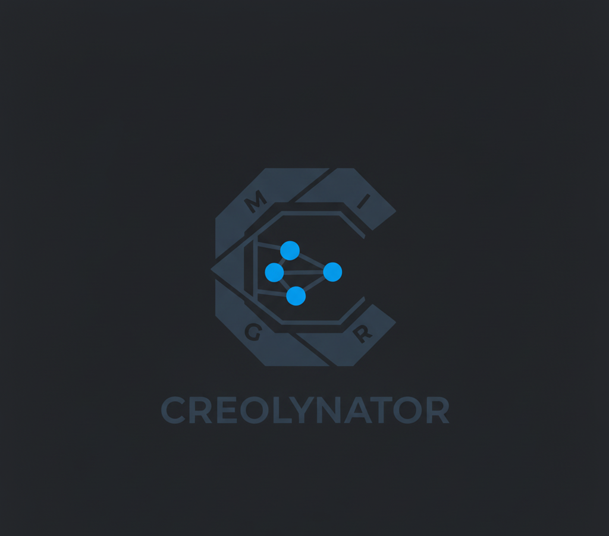

<div align="center">
<h2> Creolynator </h2>
</div>

<div align="center">

<p><b>Something Is Cooking...</b></p>
</div>

---

### The Creolynator MIGR Architecture

**Learn more about it here** : [An Informal Introduction to MIGR](assets/migr_intro.pdf)

---

### For Contributors

#### Installing and Building

```bash
git clone https://github.com/aliqyan-21/creolynator
cd creolynator
mkdir build && cd build
cmake -DCMAKE_BUILD_TYPE=debug ..
make
```

#### Testing

```bash
./build/bin/creolynator <filepath>
```

**example:**
```bash
./build/bin/creolynator tests/full_tests/4.creole
```

> NOTE: add -v for verbose output

> Output will print structural and semantic info

> **Two files will also be created**
> In `tests` directory: 
> - structural.txt
> - semantic.txt

---
